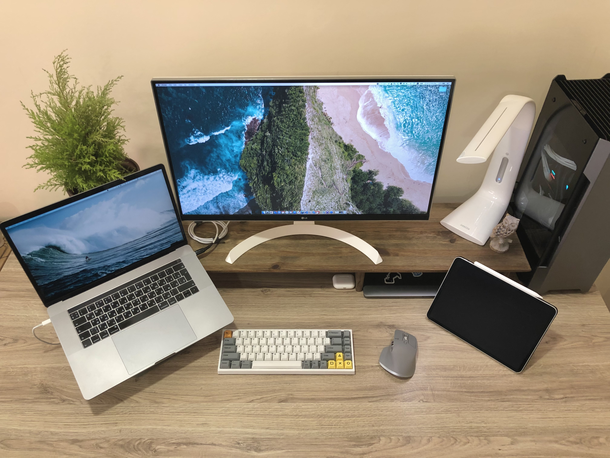

## Desk

- **Laptop:** Macbook Pro 15" for development.
- **PC**: custom mini-ITX build for gaming.
- **Monitor**: 27" 4K LG Monitor.
- **Mouse:** [MX Master 3](https://www.logitech.com/en-us/products/mice/mx-master-3.html).
- **Keyboard:** mechanical [Keydous NJ68](https://drop.com/buy/keydous-nj68-bluetooth-hot-swappable-rgb-mechanical-keyboard). Sometimes I use Apple Magic Keyboard instead.
- **Headphones**: AirPods Pro.
- **Desk:** custom height-adjustable desk with light countertop based on Conset 501-33.
- **NAS:** Synology DiskStation DS218j for backups and media.

<h2 className="pt-sm">Editor & Terminal</h2>

- **[WebStorm](https://www.jetbrains.com/ru-ru/webstorm/)** with [One Dark theme](https://plugins.jetbrains.com/plugin/11938-one-dark-theme).
  - [JS GraphQL](https://plugins.jetbrains.com/plugin/8097-js-graphql)
  - [Rainbow Brackets](https://plugins.jetbrains.com/plugin/10080-rainbow-brackets)
- **[Visual Studio Code](https://code.visualstudio.com/)** with [One Dark theme](https://marketplace.visualstudio.com/items?itemName=akamud.vscode-theme-onedark).
  - [Prettier](https://marketplace.visualstudio.com/items?itemName=esbenp.prettier-vscode)
  - [TODO Tree](https://marketplace.visualstudio.com/items?itemName=Gruntfuggly.todo-tree)
  - [GitLens — Git supercharged](https://marketplace.visualstudio.com/items?itemName=eamodio.gitlens)
  - [React Snippets](https://marketplace.visualstudio.com/items?itemName=ugross.vscode-react-snippets)
  - [Bracket Pair Colorizer](https://marketplace.visualstudio.com/items?itemName=CoenraadS.bracket-pair-colorizer)
- **[JetBrains Mono](https://www.jetbrains.com/lp/mono/)** font everywhere.
- **Terminal:** [Oh My Zsh](https://ohmyz.sh/) with [Starship prompt](https://starship.rs/).

<h2 className="pt-sm">Apps</h2>

- **[Things](https://culturedcode.com/things/)** for _[Getting Things Done](https://hamberg.no/gtd)_.
- **[Notion](https://www.notion.so/)** to stay organized.
- **[1Password](https://1password.com/)** to never worry about passwords.
- **[Spark](https://sparkmailapp.com/)** as my primary mail app.
- **[SnippetsLab](https://www.renfei.org/snippets-lab/)** to don't remember all of the `git`, `npm`, and `bash` commands.
- **Safari** for browsing.
  - **[Raindrop.io](https://raindrop.io/)** for bookmarks.
- **[Google Chrome](https://www.google.com/chrome/)** for development.
- **[Fork](https://git-fork.com/)** because terminal isn't always better.
- **[Maccy](https://maccy.app/)** to keep copy history at hand.
- **[Stretchly](https://hovancik.net/stretchly/)** to don't forget to take a break.
- **[Magnet](https://apps.apple.com/ua/app/magnet/id441258766?mt=12)** to organize and manage windows.
- **[Mate Translate](https://gikken.co/mate-translate/)** to quickly translate text.

<h2 className="pt-sm">Website</h2>

- Built with [TypeScript](https://www.typescriptlang.org/), [React](https://reactjs.org/), and [Gatsby](https://www.gatsbyjs.com/).
- [Tailwind CSS](https://tailwindcss.com/) and [SASS](https://sass-lang.com/).
- Deploy to [Vercel](https://vercel.com/).
- [Lighthouse CI](https://github.com/GoogleChrome/lighthouse-ci) with [Github Actions](https://github.com/features/actions) to prevent regressions.
