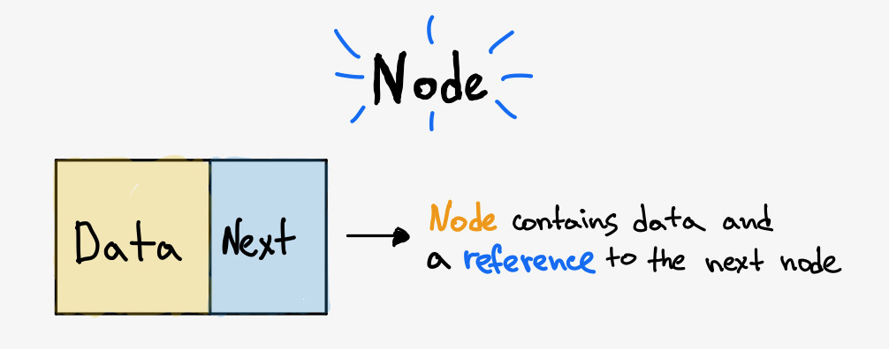
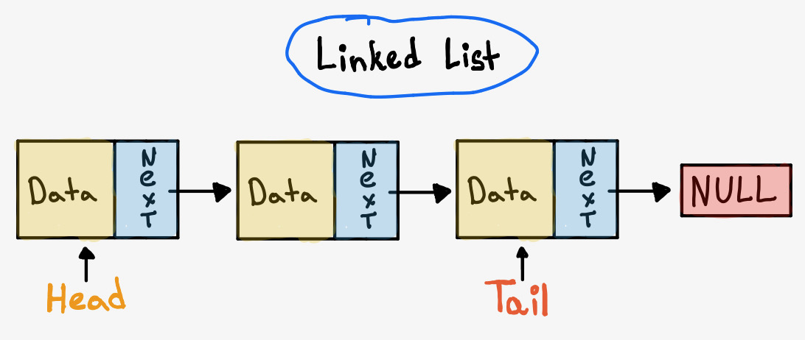

Linked list is a **linear data structure**, this means that there is a sequence and an order to how they are constructed and traversed. Inside linked list each element is stored in a form of **Node**. Node is made up of two items: the _data_ and a _reference_ to a node.



A linked list is formed from list of Nodes linked together to form a chain.

A linked list is formed when many such nodes are linked together to form a chain. The last node has a reference to **NULL**. The entry point into a linked list is called the **Head** of the list (it's a the first node of the list).



First Let's create a **Node**:

```javascript
class Node {
  constructor(value, next = null) {
    this.value = value;
    this.next = next;
  }
}
```

Now Let's code our `LinkedList` class that implements a linked list:

```javascript
class LinkedList {
  constructor() {
    this.head = null;
  }

  add(value) {
    const newNode = new Node(value);

    // If there is no head yet then create it
    if (!this.head) {
      this.head = newNode;
    } else {
      let currentNode = head;
      while (currentNode.next) {
        currentNode = currentNode.next;
      }
      currentNode.next = newNode;
    }

    return this;
  }

  delete() {}
}
```

<br/>

## Linked Lists vs Arrays

---

https://github.com/trekhleb/javascript-algorithms/blob/master/src/data-structures/linked-list/LinkedList.js
https://medium.com/@deniswells59/singly-linked-lists-with-javascript-81859a5a5095
https://medium.com/basecs/whats-a-linked-list-anyway-part-1-d8b7e6508b9d
