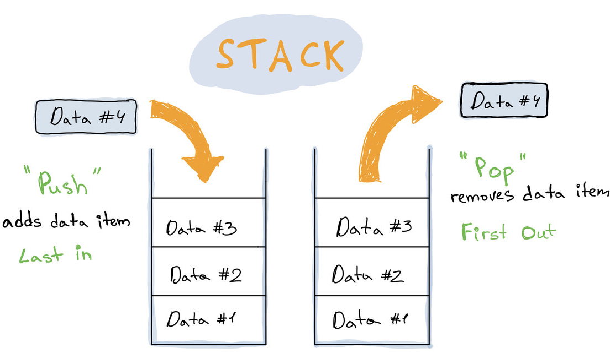

import { CodeFileName } from '../../../src/components/CodeFileName';



A Stack is a linear data structure where elements are stacked on each other. It's like an array, but with a few restrictions:

- You can't access items randomly by using their index.
- You can only add an item to the end, and remove or retrieve the latest item.

The simplest way to think about stack structure is to imagine a deck of cards, or a stack of plates.
You put a plate on top of another, and to access a plate in the middle you first need to get plates from the top.

A stack uses LIFO (last-in-first-out) ordering which means that the last pushed item to the stack is processed first (all previous items will need to wait until newer are processed).

### Base Operations

| Operation  |           Description           |
| ---------- | :-----------------------------: |
| _`push()`_ |      Add item to a stack.       |
| _`pop()`_  |    Remove item from a stack.    |
| _`peek()`_ | Get the latest item in a stack. |

### When to use

- Checking an opening/closing structure. For example, a task to detect balanced usage of opening and closing parentheses, brackets, and quotes. `[]()""([])`
- Undoing (backtracking from) an action.
- Reversing data.
- and more...

### Time complexity

| Operation | Complexity |
| --------- | :--------: |
| Insertion |    O(1)    |
| Deletion  |    O(1)    |
| \*Access  |    O(n)    |

_\*To access some value you need first to pop an element from the top._

### Code

<CodeFileName>Stack.ts</CodeFileName>

```typescript
import { LinkedList } from '../LinkedList/LinkedList';

export class Stack<T> {
  private storage = new LinkedList<T>();

  public push(value: T): void {
    this.storage.append(value);
  }

  public pop(): T | null {
    return this.storage.deleteTail()?.value || null;
  }

  public isEmpty(): boolean {
    return !this.storage.getLast();
  }

  public peek(): T | null {
    return this.storage.getLast()?.value || null;
  }

  public toArray(): T[] {
    return this.storage.toArray();
  }

  public toString(callback?: (val: T) => string): string {
    return this.storage.toString(callback);
  }
}
```

---

### Links:

- [Linked List article](/blog/data-structures-linked-list).
- Code on [Github](https://github.com/UgRoss/data-structures-typescript/tree/main/src/data-structures/Stack).
- Solve problems using Stack on [LeetCode](https://leetcode.com/tag/stack/).
- [Big-O Cheat Sheet](https://www.bigocheatsheet.com/).
