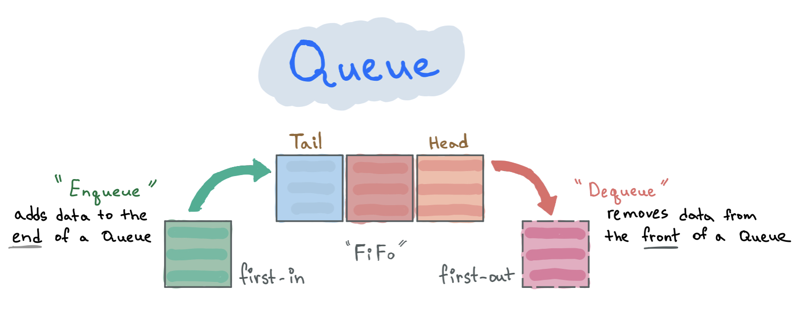

import { CodeFileName } from '../../../src/components/CodeFileName';

A Queue is a linear data structure that keeps its elements in a queue. It means that one end of a queue is used to add data into it and another end is used to remove data from it.

We often use queues in our everyday life. For example, queue at the supermarket, queue at the airport, and so on...



This ordering mechanism is also called **FIFO** \(_first-in-first-out_\) in which the first added element is processed first and the newest added element is processed last.

A Queue is like an array but with a few restrictions:

- You can't randomly access an item by its index.
- You can only add data in one end and retrieve data from the other.

### Base operations

| Operation         | Description                                    |
| :---------------- | :--------------------------------------------- |
| _`enqueue(item)`_ | add an item to the end of a queue              |
| _`dequeue()`_     | remove the first item in a queue               |
| _`peek()`_        | get an element that is in the front of a queue |

### When to use

It can be used for any task where the first data/job that arrives needs to be processed first \(FIFO\). For example, it's possible to use a queue to upload images one by one in the order they arrived.

### Time Complexity

| Operation | Complexity |
| :-------- | :--------- |
| Insertion | _O\(1\)_   |
| Deletion  | _O\(1\)_   |
| \*Access  | _O\(n\)_   |

_\*To access some value you need to remove elements that are first in a queue._

## Code

<CodeFileName>Queue.ts</CodeFileName>

```typescript
import { LinkedList } from '../LinkedList/LinkedList';

export class Queue<T> {
  private storage = new LinkedList<T>();

  /**
   * Add a new element to the end of the queue.
   * This element will be processed after all elements that are already in the queue.
   */
  public enqueue(value: T): void {
    this.storage.append(value);
  }

  /** Remove the element that is at the front of queue. */
  public dequeue(): T | null {
    return this.storage.deleteHead()?.value || null;
  }

  /** Read the element at the front of the queue without removing it */
  public peek(): T {
    return this.storage.getFirst()?.value || null;
  }

  public isEmpty(): boolean {
    return !this.storage.getFirst();
  }

  public size(): number {
    return this.storage.toArray().length;
  }

  public toString(callback?: (val: T) => string): string {
    return this.storage.toString(callback);
  }
}
```

---

### Links:

- [Linked List article](/blog/data-structures-linked-list).
- Code on [Github](https://github.com/UgRoss/data-structures-typescript/tree/main/src/data-structures/Queue).
- Solve problems using Stack on [LeetCode](https://leetcode.com/tag/queue/).
- [Big-O Cheat Sheet](https://www.bigocheatsheet.com/).
