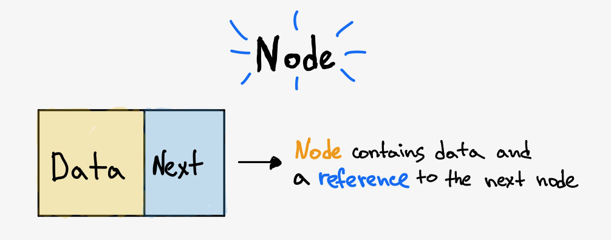
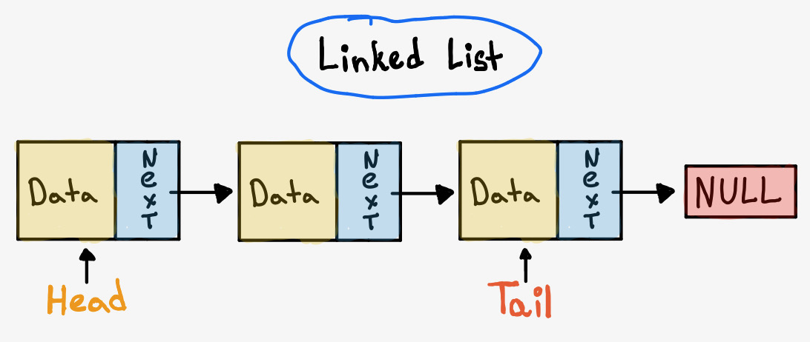
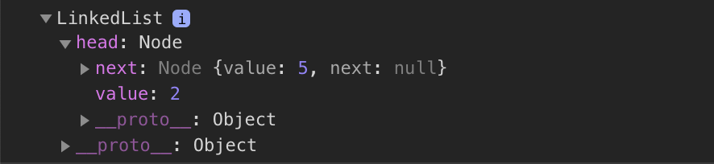
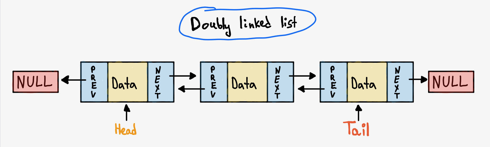

Linked list is a linear data structure, this means that there is a sequence and an order to how they are constructed and traversed.
The linked list data structure is a good choice over arrays when you don't need to have random/indexed access to your data, and when you want to have efficient insertion or deletion of elements in the beginning or in the middle of a list.
Both insertion and deletion work fast inside linked list because it doesn't require to do reindexing of elements, on the other hand accessing of an element in arrays is fast while for the linked list it takes a linear period of time to get this element.

## Table of Contents

```toc
exclude: Table of Contents
```

---

## Node

Inside the linked list each element is stored in a form of **Node**. Node is made up of two items: _data_ and a _reference/pointer_ to a node.



The linked list is formed when many such nodes are linked together to form a chain. These are the most popular linked list types:

- Singly linked list
- Doubly linked list
- Circular linked list

## Singly linked list

Singly linked list is the simplest implementation of the linked list data structure.
Each of the elements will keep _data_ and a _reference/pointer_ to a next node, in the last node next equals `null`. The entry point into a linked list is called the **Head** of the list (it's a first node of the list).
The last Node in a linked list is called the **Tail**, this part isn't necessary to include in a linked list, but it allows to avoid list traversing when you need to get the last element inside a list.



First of all, we need to create a **Node** class for our list:

```javascript:title=Node.js
class Node {
  /**
   * @param {number} value of the Node
   * @param {(Node | null)} next - reference to the next Node
   */
  constructor(value, next = null) {
    this.value = value;
    this.next = next;
  }
}
```

Next, let's create a class called `LinkedList` that contains the head and the tail with the values `null` by default.

```javascript:title=LinkedList.js
class LinkedList {
  constructor() {
    this.head = null; // First element of the linked list
    this.tail = null; // Second element of the linked list
  }
}
```

Now, let's add some methods one by one to our `LinkedList` class. The main actions for the linked list data structure are:

- Insert
- Search
- Delete

### Insertion

Based on requirements linked list insertion methods can be different.
For example, if you need to insert values only to the start of the linked list, we simply need to update the **head** of our list, and **tail** if it's empty:

```javascript:title=LinkedList.js
/**
 * Creates new node and inserts at the start of the list
 *
 * @param {number} value
 * @return {LinkedList}
 */
prepend(value) {
  // Create new node with the next reference as the head
  const newNode = new Node(value, this.head);

  // Update our head to contain new element
  this.head = newNode;

  // If there is no tail update it too
  if (!this.tail) {
    this.tail = newNode;
  }

  return this;
}
```

Let's try it:

```javascript
const linkedList = new LinkedList();
linkedList.prepend(5);
linkedList.prepend(2);

console.dir(linkedList);
```



### Searching

To implement linked list search we need to know how to do **traversing** through the linked list. As mentioned above based on access strategy
the linked list is a linear data structure, this means that we need to move from one element to another starting from the head to get to the needed Node.

The algorithm of linked list traversing is simple:

1. Start with the head of the list. Access the content of the head node if it is not `null`.
2. Then go to the next `Node`(if exists) and access the `Node` information.
3. Continue until no more Nodes.

Now let's implement our search method using this knowledge:

```javascript:title=LinkedList.js
/**
 * Finds element inside the linked list
 *
 * @param {number} value
 * @return {(Node | null)}
 */
find(value) {
  if (!this.head) {
    return null;
  }

  // 🔂 Use traversing to find our node
  let currentNode = this.head; // Save current position while moving from one Node to another.
  while (currentNode) {
    if (currentNode.value === value) {
      return currentNode;
    }

    currentNode = currentNode.next; // Update current position
  }

  // 😞 Nothing found
  return null;
}
```

ℹ️ The method above uses iteration to find value but it can be implemented using recursion.

### Deletion

Deletion of a Node can be also implemented in different ways: first node removal (using head), last node removal, or removal by value.

Implementation of the first node removal is simple, we just need to update the head to point to the next Node.
For others we need to traverse singly linked list to get to the needed point.
Let's implement deletion by value, from this it should be also clear how to remove the last node:

```javascript:title=LinkedList.js
/**
 * Removes Node from the list by its value
 *
 * @param {number} value to remove
 * @return {Node | null} remove node or null
 */
delete(value) {
  if (this.head === null) {
    return null;
  }

  let deletedNode = null; // Keep deleted Node to return it

  if (this.head.value === value) {
    deletedNode = this.head;
    // Now make next node to be a new head
    this.head = this.head.next;
  }

  let currentNode = this.head;

  // 🔂 Traverse the list only if both the head and deletedNode variables equal null
  if (currentNode !== null && deletedNode === null) {
    while (currentNode.next !== null) {
      if (currentNode.next.value === value) {
        deletedNode = currentNode.next;
        currentNode.next = currentNode.next.next;
      } else {
        currentNode = currentNode.next;
      }
    }
  }

  // Check if tail contains Node with the value we are looking for
  if (this.tail.value === value) {
    this.tail = currentNode;
  }

  return deletedNode;
}
```

---

## Doubly linked list

Doubly linked list is similar to the Singly linked list structure, difference is that Nodes store pointers to the next and previous elements.
The first Node has `null` as a pointer for the previous element, and the last Node has pointer to the next element with the value `null`.



So, in the doubly linked list we have the following:

<ul>
  <li>
    <span>Node</span>
    <ul>
      <li>
        <strong>next</strong> pointer that refers to the next Node.
      </li>
      <li>
        <strong>prev</strong> pointer that refers to the previous Node.
      </li>
    </ul>
  </li>
  <li>
    <code>head</code> - keeps first node.
  </li>
  <li>
    <code>tail</code> - keeps last node.
  </li>
</ul>

Our Node in the doubly linked list looks like the following:

```javascript:title=Node.js
class Node {
  /**
   * @param {number} value of the Node
   * @param {(Node | null)} next - reference to the next Node
   * @param {(Node | null)} previous - reference to the previous Node
   */
  constructor(value, next = null, previous = null) {
    this.value = value;
    this.next = next;
    this.previous = previous;
  }
}
```

Doubly linked list operations are similar to the singly linked list, except that you need to keep updated `previous` pointer of a Node too.

Let's take a look how our prepend method can look like for the doubly linked list:

```javascript:title=DoublyLinkedList.js
class DoublyLinkedList {
  constructor() {
    this.head = null; // First element of the linked list
    this.tail = null; // Last element of the linked list
  }

  /**
   * Creates new node and inserts at the start of the list
   *
   * @param {number} value
   * @return {DoublyLinkedList}
   */
  prepend(value) {
    const newNode = new Node(value, this.head);

    // if there is head, then update it's previous reference as it won't be head anymore
    if (this.head) {
      this.head.previous = newNode;
    }
    this.head = newNode;

    // If there is no tail create it
    if (!this.tail) {
      this.tail = newNode;
    }

    return this;
  }
}
```

Full code implementation is available at the end of the article.

---

## Time Complexity

| Operation                       | Complexity |
| ------------------------------- | ---------- |
| Access                          | O(n)       |
| Insertion (to the head or tail) | O(1)       |
| Search                          | O(n)       |
| Deletion                        | O(n)       |

<p>
  <small>**N** is the length of Linked List</small>
</p>

---

## Links

- Singly Linked List using TypeScript on [GitHub](https://github.com/UgRoss/data-structures-typescript/tree/main/src/data-structures/LinkedList).
- Doubly Linked List using TypeScript on [GitHub](https://github.com/UgRoss/data-structures-typescript/tree/main/src/data-structures/DoublyLinkedList).
- Linked list vs Array on [geeksforgeeks](https://www.geeksforgeeks.org/linked-list-vs-array/).
- Solve problems using linked list on [LeetCode](https://leetcode.com/tag/linked-list/).
