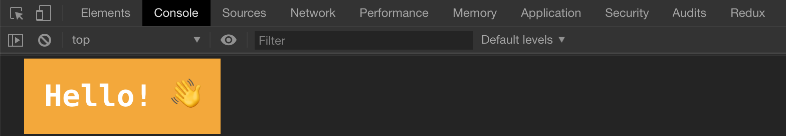
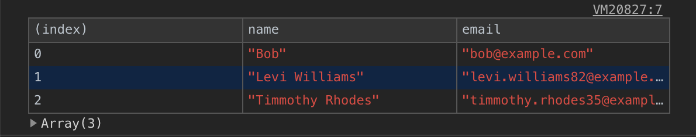
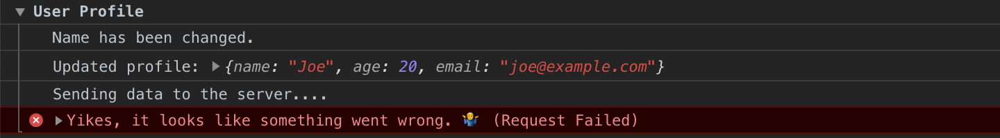
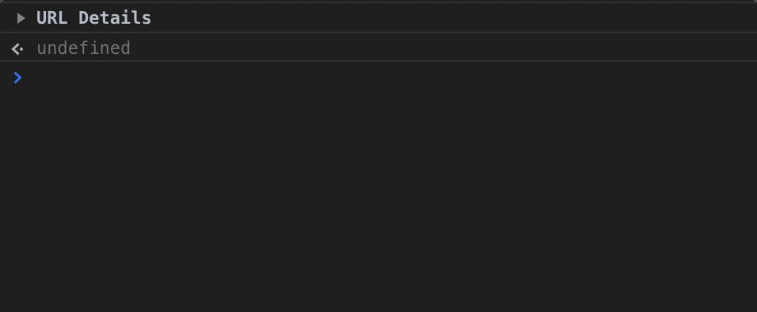
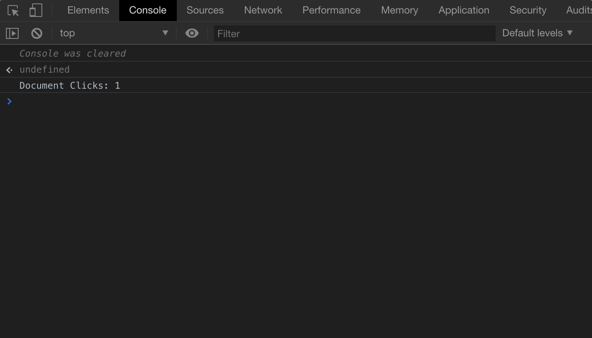
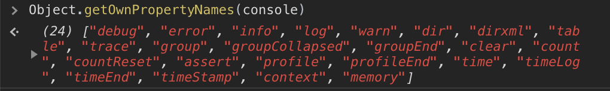

`console.log` is one of the most basic and common debugging tools in JavaScript.
The `console` object gives us access to the browser’s console and allows to output different types of data that can help to debug code.
This object has a lot of methods about existence some people even don’t realize. In this article, I want to share some useful methods to make debugging easier and faster.

### Table of Contents

```toc
exclude: Table of Contents
```

---

## console.log() and friends

Most commonly used `console` method is of course `console.log()`.
But there are several other methods to make output more eye-catching.

| Method          | Description                                                    |
| --------------- | -------------------------------------------------------------- |
| `console.log`   | Used for general output                                        |
| `console.info`  | Outputs an informational message. In Chrome it's same as `log` |
| `console.warn`  | Outputs a warning message                                      |
| `console.error` | Outputs an error message. Also, includes stack trace           |

If you pass multiple parameters in the selected method, they will be appended together in the same order.

```javascript
console.log('String', 123, { foo: 'bar' }, [1, 2, 3]);
```


**String Substitutions**

This technique allows us to create kind of placeholders inside a string that are replaced by other arguments we passed to the function.

```javascript
console.log('String %s usage', 'Substitutions');
// -> String Substitutions usage
```

It’s also possible to use placeholders for different types of values:

| Format Specifier | Description                    |
| ---------------- | ------------------------------ |
| `%s`             | String                         |
| `%i` or `%d`     | Integer                        |
| `%f`             | Floating point number          |
| `%o`             | DOM element or object          |
| `%O`             | `console.dir` behaviour        |
| `%c`             | Applies CSS to the log message |

I want to tell you about `%c` as all other placeholders are pretty understandable and it might be easier to just use ES6 template literals.

```javascript
const str = 'Substitutions';
console.log(`String ${str} usage`);
// -> String Substitutions usage
```

So, with the `%c` placeholder we can add styles to our console logs.
Let’s make our console logs to pop in different colors.

```javascript
const styles = [
  'background: orange',
  'color: white',
  'font-size: 30px',
  'font-weight: 700',
  'padding: 20px',
].join(';');

console.log('%cHello! 👋', styles);
```



---

## console.table()

This method is useful to display tabular data as a table. It’s cleaner than inspecting an array of objects returned by `console.log`.
`console.table` might be helpful if you need to check data returned by a server.

```javascript
const contacts = [
  { name: 'Bob', email: 'bob@example.com' },
  { name: 'Levi Williams', email: 'levi.williams82@example.com' },
  { name: 'Timmothy Rhodes', email: 'timmothy.rhodes35@example.com' },
];

console.table(contacts);
```



The first column in the table is `index`, For an array values there will its indices, and for object it will be property names.

---

## console.dir()

This method is pretty similar to the `log` and used to display a list of properties in an object.
The most useful way of using the `dir` method is to print the DOM elements.

```javascript
const link = document.getElementsByTagName('a')[0];
console.log('⬇ console.log:');
console.log(link);
console.log('⬇ console.dir:');
console.dir(link);
```


However, we can get the same using `console.log` method and object placeholder:

```javascript
console.log('%o', document.body);
```

---

## console.group()

This method is useful when you want to group related output together. The `console.group` takes an optional parameter to name the group of output. To end the grouping you just need to call `console.groupEnd()` .

```javascript
console.group('User Profile');
console.log('Name has been changed.');
console.log('Updated profile:', {
  name: 'Joe',
  age: 20,
  email: 'joe@example.com',
});
console.log('Sending data to the server....');
console.error('Yikes, it looks like something went wrong. 🤷‍♂️ (Request Failed)');
console.groupEnd();
```



There is `console.groupCollapsed()` method to create collapsed group by default and it works in the same way as `console.group()`:

```javascript
console.groupCollapsed('URL Details');
console.log('Host: example.com');
console.log('Protocol: https');
console.log('Path: /hello');

console.group('Query string parameters');
console.log('id: 5');
console.log('message: Hello');
console.groupEnd();
console.groupEnd();
```



As you can see it’s also possible to create groups inside groups.

---

## console.time()

The `console.time(label)` method allows to track for how long it takes for a piece of code to execute. To stop tracking `console.timeEnd(label)` should be called.

```javascript
console.time();
// 🕐 some code...
console.timeEnd(); // -> default: 3.696044921875ms

// ⬇ or with label
console.time('array parsing');
// 🕐 some code...
console.timeEnd('array parsing'); // -> array parsing: 2.5419921875ms
```

---

## console.count()

The `console.count(label)` method simply outputs number of times it has been called.

```javascript
document.addEventListener('click', () => console.count('Document Clicks'));
```

To clear counter we can use `console.countReset(label)`

```javascript
console.countReset('Document Clicks');
```



---

## console.clear()

The `console.clear()` method clears output in the console window.

---

## Conclusion

The `console.log` is the most common method for basic debugging, but there are various other methods that can be
more useful and effective in a particular situation.

The `console` has more methods that are not covered in this article:


You can read more about them here [MDN Web Docs](https://developer.mozilla.org/en-US/docs/Web/API/console).
