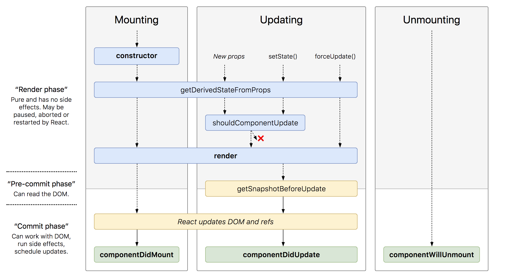

In this article, we are going to explore React lifecycle methods. As for me, if you want to work with the React this knowledge is crucial because you need to be able to implement component logic in the right place.

## Table of Contents

```toc
exclude: Table of Contents
```

---

## React Versions Difference

I'm going to talk about React version 16.4+. But before we will dive in, let's discuss versions difference. If you are completely new to React, I believe you can skip this section and return to it later.

From the React 16.3 and above a few lifecycle methods were deprecated. They are still available to use with the
prefix `UNSAFE_`, but will be removed in the next major release.

- `componentWillMount` renamed to `UNSAFE_ComponentWillMount`. You can use the `constructor` to replace this method.
- `componentWillReceiveProps` renamed to `UNSAFE_ComponentWillReceiveProps`. You can use `static getDerivedStateFromProps` instead.
- `componentWillUpdate` renamed to `UNSAFE_ComponentWillUpdate`. You can use `getSnapshotBeforeUpdate` instead.

There is also one more difference between _16.3_ and _^16.4_:

- `static getDerivedStateFromProps`
  <br />
  <span>
    In the version <i>16.3</i> <code className="language-text">getDerivedStateFromProps</code> is
    called only once new props are received, but starting from the{' '}
    <code className="language-text">16.4</code> this method is called every time regardless what
    caused the update (new props, <i>setState()</i>, <i>forceUpdate()</i>
    ).
  </span>

## Phases of the React component Lifecycle



This image represents React _^16.4_ Components Lifecycle. It would be good if you could spend some time to study it, I also recommend you to return to this image during the article reading, so it will be easier to understand and to remember many things.

As we can see from the image, React component goes through the following phases:

- [**Mounting**](#mounting-phase)
- [**Updating**](#updating-phase)
- [**Unmounting**](#unmounting-phase)

---

### Mounting Phase

This is the birth of our component. It means that the component goes through this phase during its initialization and first insertion into the DOM.

#### <i>constructor</i>

```javascript
constructor(props) {}
```

This is just a class constructor, and it's the first method that is called when the component is created. The constructor is called only once in the whole component lifecycle.

**When to use:** initialize state, initialize properties, create refs, create methods bindings.

```javascript
class ComponentDemo extends React.Component {
  constructor(props) {
    super(props);

    this.state = {
      loading: false,
      items: [],
    };

    this.onClick = this.onClick.bind(this);

    this.wrapperRef = React.createRef();
  }
}
```

<Alert type="info">
  <p>
    If you don't know why do we use <code className="language-text">super(props)</code>, I recommend
    to check this article:{' '}
    <a
      href="https://overreacted.io/why-do-we-write-super-props/"
      target="_blank"
      rel="nofollow noopener noreferrer"
    >
      Why Do We Write super(props)?
    </a>
    .
  </p>
</Alert>

Also, by using the [class field proposal](https://github.com/tc39/proposal-class-fields) we can remove `constructor`

```javascript
class ComponentWithoutConstructor extends React.Component {
  // Create ref without constructor
  wrapperRef = React.createRef();

  // Create State without constructor
  state = {
    loading: false,
    items: [],
  };

  // Use arrow function for callbacks to prevent
  // Function​.prototype​.bind() usage.
  onClick = () => {
    /*...*/
  };
}
```

#### <i>static getDerivedStateFromProps</i>

```javascript
static getDerivedStateFromProps(props, state) {}
```

The goal of this method is to make sure that state and props are in sync.

This method is **static**, so it doesn't have access to _this_ and it should avoid any side effects. Instead, it's expected from you to return an object that will be merged with
the state, or _null_ if nothing to update.

**When to use**: update state based on props.

```javascript
class ComponentDemo extends React.Component {
  static getDerivedStateFromProps(props, state) {
    if (props.loading !== state.loading) {
      return { loading: props.loading };
    }

    // Return null if the state hasn't changed
    return null;
  }
}
```

Our returned object is similar to if we call _this.setState_ in other non-static lifecycle methods.

```javascript
this.setState({ loading: props.loading });
```

<Alert type="info">
  <p>
    In the current phase (mounting) it's also possible to use the{' '}
    <code className="language-text">constructor</code> instead of this method.
  </p>
</Alert>

#### <i>render</i>

This is the only **required** method in every react class component. In the same time, it's the most used lifecycle method; you
will spend a lot of time here.

```javascript
render() {
  return <p>Hello, {this.props.name}</p>
}
```

As you can see in the example above, the _render()_ method returns JSX that will be used to update the DOM. It can return JSX or _null_ if nothing to display.

<Alert type="info">
  <p>
    It's not recommended to change the state during rendering. React requires the{' '}
    <code className="language-text">render()</code> method to be pure (it doesn't modify the state,
    doesn't directly interact with the browser, and returns the same result for the same props and
    state).
  </p>
</Alert>

**When to use:** return component representation using JSX.

#### <i>componentDidMount</i>

This method is called right after our component did mount (was inserted into the tree). It's the right time to do API calls.

```javascript
async componentDidMount() {
  try {
    const userDetials = await axios.get(`${apiUrl}/user?ID=12345`);
    this.setState({ details: userDetials });
  } catch(err) {
    this.setState({ error: true });
  } finally {
    this.setState({ loading: false });
  }
}
```

**When to use**: API calls, DOM manipulation, integration with 3rd-party libraries that need DOM access.

---

### Updating Phase

This phase starts when our component receives new props or if the current state was changed.

It's also possible to manually run the component updating phase by using _this.forceUpdate()_ method. Note that in this case the [shouldComponentUpdate](#2️⃣-shouldcomponentupdate) method invocation will be **ignored**.

#### <i>static getDerivedStateFromProps</i>

The behavior of this method is the same as described [above](#2️⃣-static-getderivedstatefromprops). You can update your state based on props here.

<Alert type="info">
  <p>
    It's not recommended to keep your state updated based on props, as it makes your component
    difficult to think about. Try to think first if you really need this inside the state, or you
    can just derive functionality from the props directly because{' '}
    <code className="language-text">getDerivedStateFromProps</code> should be used in{' '}
    <a
      href="https://reactjs.org/blog/2018/06/07/you-probably-dont-need-derived-state.html#when-to-use-derived-state"
      target="_blank"
      rel="nofollow noopener noreferrer"
    >
      rare cases
    </a>
    .
  </p>
</Alert>

#### <i>shouldComponentUpdate</i>

```javascript
shouldComponentUpdate(nextProps, nextState) {}
```

Once component receives new props or a new state it has to be updated. With the help of _shouldComponentUpdate_, we can tell react that we don't want to this when we think that
this is not needed.

The _shouldComponentUpdate_ has access to two arguments that represent next props and next state. We need to return boolean to tell React if we want to update the component,
by default it's always `true`.

**Usage:** This method should be used only for performance optimization.

<Alert type="info">
  You can consider using built-in
  [React.PureComponent](https://reactjs.org/docs/react-api.html#reactpurecomponent) instead of
  manually writing `shouldComponentUpdate`.
</Alert>

#### <i>render</i>

```javascript
render() {}
```

Now, our component re-renders to returns updated JSX.

#### <i>getSnapshotBeforeUpdate</i>

```javascript
getSnapshotBeforeUpdate(prevProps, prevState) {}
```

This method is called right before our component is ready to be inserted into the DOM. Consequently, it's the last time when you can access the DOM before it gets updated
with the rerendered component.

In this method we have access to the _previous props_ and _previous state_ arguments. You can also get the current state and current props through _this_. Any value that you return here will be passed as a parameter to a _componentDidUpdate_ (next method in this phase).

In many cases, you will not need this method, but sometimes it's very handy. Let's imagine that we have a chat app where new messages appear in the bottom. If user scrolled to the bottom of the list it would be good to keep this scroll position even if the list of messages is growing, so that the user would not need to scroll to the new messages manually to see them. To solve this, we can detect if the current scroll position is the bottom of the list and then return _true_ or _false_, so that the _componentDidUpdate_ can handle it and adjust scroll position if needed.

**When to use:** capture information from the DOM before it's changed, for example, scroll position or cursor selection.

<Alert type="info">
  <p>
    Even though this method isn't static it's recommended to return a value that will be passed to
    the <i>componentDidUpdate</i> instead of changing the state.
  </p>
</Alert>

```javascript
getSnapshotBeforeUpdate(prevProps, prevState) {
  if (prevState.messages.length < this.state.messages.length) {
    const listRef = this.listRef.current;
    // Here we detect if user scroll position is at the very bottom and ruturn boolean
    return listRef.scrollTop + listRef.offsetHeight >= listRef.scrollHeight;
  }

  return null;
}
```

#### <i>componentDidUpdate</i>

```javascript
componentDidUpdate(prevProps, prevState, snapshot) {}
```

This method is called right after the component gets updated inside the DOM.

In the _componentDidUpdate_ we have access to the three arguments: _previous props_, _previous state_, and _snapshot_ (data passed from the _getSnapshotBeforeUpdate_).

**When to use:** the purpose of the _componentDidUpdate_ is similar to the _componentDidMount_. It's a good idea to do API calls,
or 3rd-party libraries updating here.

Let's resume solving the issue I've described in the _getSnapshotBeforeUpdate_ section. We are interested in the snapshot only if it equals true, it means that the user
was in the bottom of the list before component was updated, and we need to update scroll position to keep the user at the bottom after

```javascript
componentDidUpdate(prevProps, prevState, snapshot) {
  if (snapshot === true) {
    const listRef = this.listRef.current;
    // Adjust the position so scroll will be at the bottom again
    listRef.scrollTop = listRef.scrollHeight - listRef.offsetHeight;
  }
}
```

---

### Unmounting Phase

In this phase the component is not needed anymore and it will be unmounted from the DOM.

#### <i>componentWillUnmount</i>

```javascript
componentWillUnmount() {}
```

This is the last method in the React component lifecycle. It's executed right before our component removal from the DOM.
This method should be used to perform the necessary cleanups.

**When to use:** clear timers, cancel network requests, destroy 3rd party UI library elements, and so on...

<Alert type="info">
  Think about it as a reverting action for things we did inside `componentDidMount` or
  `componentDidUpdate`.
</Alert>

---

## Further Reading

- [reactjs.org | React.Component API reference](https://reactjs.org/docs/react-component.htm)
- [reactjs.org | React.PureComponent](https://reactjs.org/docs/react-component.htm)
- The image you saw at the start of the article is from this [GitHub project](http://projects.wojtekmaj.pl/react-lifecycle-methods-diagram/). You can explore here the difference between React versions.
